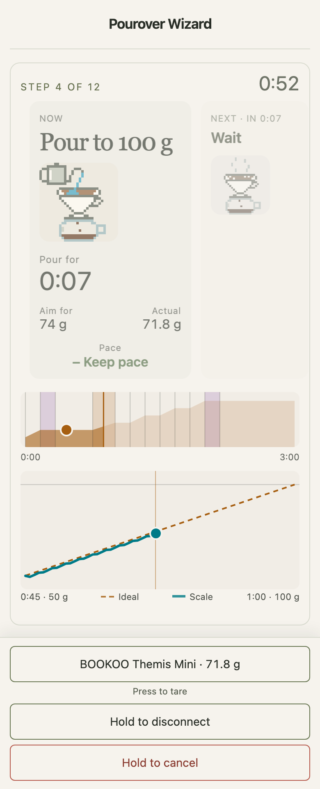

# Pourover Wizard

[](https://github.com/NikolaiAndreadi/pourover-wizard/actions/workflows/check.yml)
[](https://github.com/NikolaiAndreadi/pourover-wizard/actions/workflows/codeql.yml)
[](LICENSE)

A guided V60 pour-over timer. Pick a recipe, set your coffee amount, and follow step-by-step cues.
Connect a BOOKOO scale over Bluetooth and the guide shows your pour against the target in real time.

**Try it:** <https://nikolaiandreadi.github.io/pourover-wizard/>



## What it does

- **Popular recipes with preview.** Step through a recipe before brewing, with short hints for every step.
- **Brew assist.** While brewing, the app shows the current step and the next one, so the process stays predictable.
  With a supported scale connected, it guides your pour rate and amount at each step.
- **Brew summary and history.** Recall your last 50 brews to spot recurring mistakes and improve your technique.
- **Works offline.** Installable as a web app; once loaded it runs without a network.
- **Private by design.** No account, no server, no analytics. Brews and settings stay in your browser or on your device.

## Using it

### In a browser

Open the link above. For live scale assist you need a browser with Web Bluetooth: Chrome or Edge on desktop or Android.
Safari and Firefox run the timer-only mode. The scale chooser is filtered to supported scales.

### On iPhone and iPad

For timer-only brewing, Safari's **Add to Home Screen** is enough.
Safari has no Web Bluetooth, so there are two ways to brew with a scale:

1. **Web Bluetooth browser.** Install
   [Bluefy](https://apps.apple.com/app/bluefy-web-ble-browser/id1492822055)
   and open the same link in it. Live scale assist works there. No install beyond the browser.
2. **Native app via SideStore.** Download `PouroverWizard.ipa` from the
   [Releases page](https://github.com/NikolaiAndreadi/pourover-wizard/releases),
   install [SideStore](https://docs.sidestore.io/docs/intro), then import the
   IPA from Files in SideStore's **My Apps** screen. SideStore signs it with
   your free Apple ID and refreshes it; see the
   [SideStore FAQ](https://docs.sidestore.io/docs/faq) for its limits. The
   app uses native Bluetooth and asks for permission on first connect. A more involved setup.

## Supported scales

| Scale              | Status                                           |
|--------------------|--------------------------------------------------|
| BOOKOO Themis Mini | Verified on hardware                             |
| BOOKOO Ultra Scale | Written against vendor protocol docs, untested   |

Contributions for other scales are welcome; see [CONTRIBUTING.md](CONTRIBUTING.md).

## Recipes

| Recipe           | Author         | Default      | Done around | Source                                                                                                                                                             |
|------------------|----------------|--------------|-------------|--------------------------------------------------------------------------------------------------------------------------------------------------------------------|
| Better 1 Cup V60 | James Hoffmann | 15 g / 250 g | 3:00        | [Video](https://www.youtube.com/watch?v=1oB1oDrDkHM), [Hario](https://www.hario-usa.com/blogs/recipes-and-more-from-friends/james-hoffmann-1-cup-v60-technique)    |
| Ultimate V60     | James Hoffmann | 30 g / 500 g | 3:30        | [Video](https://www.youtube.com/watch?v=AI4ynXzkSQo), [Hario](https://www.hario-usa.com/blogs/recipes-and-more-from-friends/james-hoffmann-uitimate-v60-technique) |
| 4:6 Method       | Tetsu Kasuya   | 20 g / 300 g | 3:30        | [Philocoffea](https://en.philocoffea.com/blogs/blog/coffee-brewing-method)                                                                                         |

## Good to know

- Recipes run on the clock. Methods with drainage-triggered steps, such as Scott Rao's, are not supported yet.
- A Bluetooth drop stops a live brew and keeps its time and chart. Reconnect and tare again for the next one.
- Everything about scale behavior was verified on one BOOKOO Themis Mini. Reports from other scales and firmware versions help.

## Development

Node 26 and npm 12, then:

```sh
npm ci
npm run dev      # local app at /pourover-wizard/
npm run check    # type checks, lint, architecture, unit and browser tests
```

[CONTRIBUTING.md](CONTRIBUTING.md) covers the toolchain, the quality gates, the layered architecture, CI, and how to build the iOS app.

## License

[GNU General Public License v3.0](LICENSE). You may use, share and change the app, and anything you distribute based on it
must stay under the same license. Recipes remain the work of their authors and are credited in the app.
